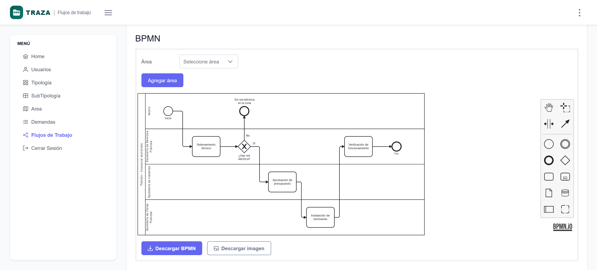
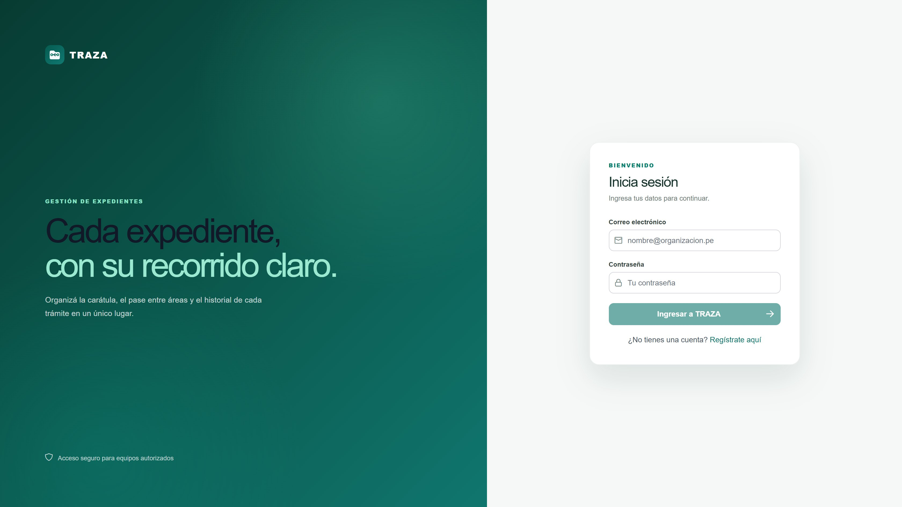
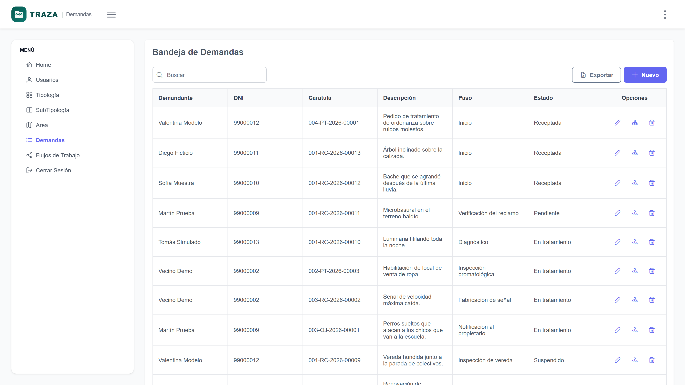

# TRAZA — gestor de expedientes (web)

Frontend del sistema de mesa de entradas municipal. Incluye el modeler BPMN con el que se dibujan los circuitos de cada trámite.

Backend: [gestor-expedientes-api](https://github.com/Jmurga16/gestor-expedientes-api) · Demo: https://gestor-expedientesv1.azurewebsites.net



## Qué hace

Cada tipo de trámite municipal tiene un circuito dibujado en BPMN, con un carril por área. Los expedientes avanzan por ese circuito y cada movimiento queda registrado.



| Pantalla | Qué permite |
|---|---|
| Dashboard | totales de expedientes por estado |
| Bandeja | listado paginado y filtrado por rol, con búsqueda y exportación a Excel |
| Alta de expediente | si la terna elegida no tiene circuito definido, avisa en el formulario |
| Diagrama del expediente | el BPMN del expediente, el cambio de paso y estado, y el historial; si está finalizado avisa y no deja guardar |
| Flujos de trabajo | el modeler: dibujar el circuito, agregar carriles por área, descargarlo como `.bpmn` o como PNG |
| Catálogo | áreas, tipologías y subtipologías |
| Usuarios | ABM con área y roles |

El menú lateral se arma según el rol, y las rutas de administración están detrás de un guard: un vecino no ve Usuarios ni Flujos de Trabajo, y tampoco llega escribiendo la URL.



## Stack

Angular 18 · PrimeNG 17 · PrimeFlex · bpmn-js 18 · SweetAlert2

## Estructura

```
src/app
├── auth        login, registro y guards
├── core        layout, menú, interceptores y modelos genéricos
├── modules     un módulo por agregado, cargado lazy
│   ├── area
│   ├── tipologia
│   ├── user
│   ├── workflow
│   └── demanda
└── shared      modeler BPMN, loading, pipes y servicios transversales
```

Cada módulo repite la misma forma: `common/models`, `common/services`, `pages/` y su routing. La bandeja de expedientes pagina del lado del servidor (`p-table` en modo lazy), no trae todo y filtra en el navegador.

## Puntos de interés del código

**El modeler** (`shared/components/diagram`) envuelve `bpmn-js`. Agregar un área al circuito no es manipular el XML a mano: usa la API `modeling` de bpmn-js (`addLane`, `updateProperties`), que mantiene la coherencia del diagrama y su DI. El carril queda con `id = Lane_{idArea}`, que es lo que después lee el backend para saber por qué áreas pasa el expediente.

**Exportar el diagrama como imagen** sale de `saveSVG()` rasterizado en un `<canvas>` a 2×, sin dependencias extra.

**Los pasos del expediente** no vienen de la base: se leen del propio diagrama importado, filtrando las `bpmn:Task`, más `Finalizado` que se agrega siempre al final.

**El token** se guarda en `localStorage` y lo inyecta un interceptor. Otro interceptor centraliza los errores y distingue el fallo de conexión del error del servidor, así que ningún componente repite el manejo de errores HTTP.

## Levantarlo local

Hace falta Node 20 o 22 y la API andando en `http://localhost:8080` (ver [gestor-expedientes-api](https://github.com/Jmurga16/gestor-expedientes-api)).

```bash
npm install
npm start
```

Queda en `http://localhost:4200`. La URL de la API y la del storage salen de `src/environments/environment.development.ts`.

## Build y despliegue

```bash
npm run build
```

Deja el sitio en `dist/expedientes-front/browser/`. Es una SPA sin SSR: `src/web.config` reescribe las rutas a `index.html` para que funcione el refresco sobre cualquier ruta en un App Service de Windows.

Se publica subiendo el contenido de esa carpeta a `site/wwwroot`.

## Tests

```bash
npm test
```

Cubren la precedencia de roles y el vencimiento del token, el modo sólo lectura del formulario de usuarios, y el armado de carriles en el modeler: el id que después lee el backend, que no se dupliquen áreas y que el pool crezca.
